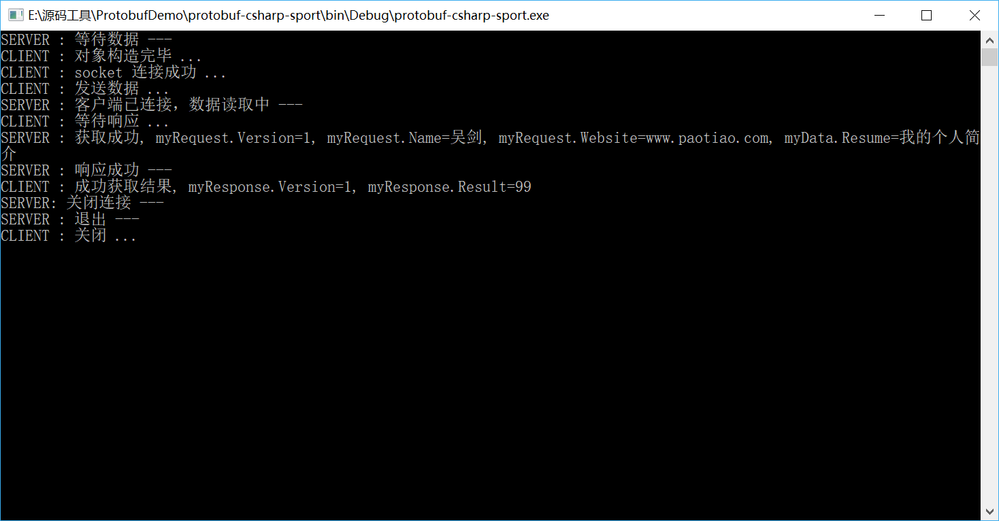

#Google.ProtoBuf

protoBuf是google 的一种数据交换的格式，它独立于语言，独立于平台。google 提供了多种语言的实现：java、c#、c++、go 和 python，每一种实现都包含了相应语言的编译器以及库文件。由于它是一种二进制的格式，比使用 xml 进行数据交换快许多。 


### 优点

与同类型的数据交换格式相比（诸如json，xml），由于protobuf是基于二进制数据传输格式，因此它具有高效的解析速度和更小的体积，并且由于它是直接基于.proto文件生成对应语言的数据结构，因此它的转换过程更加简单直接。同时因为protobuf实现都包含了相应语言的编译器以及库文件，它将比传统的基于一套规范解析更加精准可控，误解的概率更低。

####综上优点 :

> 高效的解析速度

>  小巧的传输体积

> 直接上手，简单易用

> 解析可控，误解率低

### 缺点

与传统的数据交换格式相比，由于基于二进制数据传输格式，protobuf可读性为零。同时虽然protobuf强调的是跨平台性，但相较于json，xml来说，protobuf的语言覆盖率偏低，并且手动开发一个自定义protobuf的工作量也偏大。

#### 综上缺点 :

> 可读性低

> 语言支持相对少

### 用途

作为一种效率和兼容性都很优秀的二进制数据传输格式，可以用于分布式应用之间的数据通信或者异构环境1，并且在传统的cs架构的环境中，protobuf也可以用作客户端服务端公用的数据交换格式。


[Github地址](https://github.com/protocolbuffers/protobuf)

下载**ProtoGen** 

### 转换proto 到cs

保存下面文件到Login.proto文件，注意:文件名为**proto**

```
// 登陆请求
message ReqLogin {
	optional string account = 1; // 账号
	optional string password = 2; // 密码
}
//创建账号
message ReqCreateAccount{
	optional string account = 1; // 账号
	optional string password = 2; // 密码
}
//创建角色
message ReqCreateRole{
	optional string uid = 1; // 用户ID
	optional string user_name = 2; // 角色名
}
//获取角色基本信息
message ReqGetRole{
	optional string uid = 1; // 用户ID
}
//获取角色基本信息
message ResGetRole{
	optional string uid = 1; // 用户ID
	optional string user_name = 2; // 角色名
	optional int32 endurance = 3; // 耐力
	optional int32 gold = 4;//金币
	optional int32 wing = 5;//元宝
	optional int32 lv = 6;//等级
	optional int32 vip = 7;//vip等级
	optional int32 head = 8;//头像
}
```

然后管理员模式运行命令行:

```
C:\Users\hc>e:
E:\>cd E:\源码工具\ProtoGen
E:\源码工具\ProtoGen>protogen.exe -i:protos\Login.proto -o:cs\Login.cs
protobuf-net:protogen - code generator for .proto
```

注意：>protogen.exe -i:protos\Login.proto -o:cs\Login.cs命令的意思是在ProtoGen.exe的目录下  把protos文件夹里面的Login.proto 转换为 cs文件下的 Login.cs文件

转换后的Login.cs文件内容为:

```c#
//------------------------------------------------------------------------------
// <auto-generated>
//     This code was generated by a tool.
//
//     Changes to this file may cause incorrect behavior and will be lost if
//     the code is regenerated.
// </auto-generated>
//------------------------------------------------------------------------------

// Generated from: protos/Login.proto
namespace protos.Login
{
  [global::System.Serializable, global::ProtoBuf.ProtoContract(Name=@"ReqLogin")]
  public partial class ReqLogin : global::ProtoBuf.IExtensible
  {
    public ReqLogin() {}
    
    private string _account = "";
    [global::ProtoBuf.ProtoMember(1, IsRequired = false, Name=@"account", DataFormat = global::ProtoBuf.DataFormat.Default)]
    [global::System.ComponentModel.DefaultValue("")]
    public string account
    {
      get { return _account; }
      set { _account = value; }
    }
    private string _password = "";
    [global::ProtoBuf.ProtoMember(2, IsRequired = false, Name=@"password", DataFormat = global::ProtoBuf.DataFormat.Default)]
    [global::System.ComponentModel.DefaultValue("")]
    public string password
    {
      get { return _password; }
      set { _password = value; }
    }
    private global::ProtoBuf.IExtension extensionObject;
    global::ProtoBuf.IExtension global::ProtoBuf.IExtensible.GetExtensionObject(bool createIfMissing)
      { return global::ProtoBuf.Extensible.GetExtensionObject(ref extensionObject, createIfMissing); }
  }
  
  [global::System.Serializable, global::ProtoBuf.ProtoContract(Name=@"ReqCreateAccount")]
  public partial class ReqCreateAccount : global::ProtoBuf.IExtensible
  {
    public ReqCreateAccount() {}
    
    private string _account = "";
    [global::ProtoBuf.ProtoMember(1, IsRequired = false, Name=@"account", DataFormat = global::ProtoBuf.DataFormat.Default)]
    [global::System.ComponentModel.DefaultValue("")]
    public string account
    {
      get { return _account; }
      set { _account = value; }
    }
    private string _password = "";
    [global::ProtoBuf.ProtoMember(2, IsRequired = false, Name=@"password", DataFormat = global::ProtoBuf.DataFormat.Default)]
    [global::System.ComponentModel.DefaultValue("")]
    public string password
    {
      get { return _password; }
      set { _password = value; }
    }
    private global::ProtoBuf.IExtension extensionObject;
    global::ProtoBuf.IExtension global::ProtoBuf.IExtensible.GetExtensionObject(bool createIfMissing)
      { return global::ProtoBuf.Extensible.GetExtensionObject(ref extensionObject, createIfMissing); }
  }
  
  [global::System.Serializable, global::ProtoBuf.ProtoContract(Name=@"ReqCreateRole")]
  public partial class ReqCreateRole : global::ProtoBuf.IExtensible
  {
    public ReqCreateRole() {}
    
    private string _uid = "";
    [global::ProtoBuf.ProtoMember(1, IsRequired = false, Name=@"uid", DataFormat = global::ProtoBuf.DataFormat.Default)]
    [global::System.ComponentModel.DefaultValue("")]
    public string uid
    {
      get { return _uid; }
      set { _uid = value; }
    }
    private string _user_name = "";
    [global::ProtoBuf.ProtoMember(2, IsRequired = false, Name=@"user_name", DataFormat = global::ProtoBuf.DataFormat.Default)]
    [global::System.ComponentModel.DefaultValue("")]
    public string user_name
    {
      get { return _user_name; }
      set { _user_name = value; }
    }
    private global::ProtoBuf.IExtension extensionObject;
    global::ProtoBuf.IExtension global::ProtoBuf.IExtensible.GetExtensionObject(bool createIfMissing)
      { return global::ProtoBuf.Extensible.GetExtensionObject(ref extensionObject, createIfMissing); }
  }
  
  [global::System.Serializable, global::ProtoBuf.ProtoContract(Name=@"ReqGetRole")]
  public partial class ReqGetRole : global::ProtoBuf.IExtensible
  {
    public ReqGetRole() {}
    
    private string _uid = "";
    [global::ProtoBuf.ProtoMember(1, IsRequired = false, Name=@"uid", DataFormat = global::ProtoBuf.DataFormat.Default)]
    [global::System.ComponentModel.DefaultValue("")]
    public string uid
    {
      get { return _uid; }
      set { _uid = value; }
    }
    private global::ProtoBuf.IExtension extensionObject;
    global::ProtoBuf.IExtension global::ProtoBuf.IExtensible.GetExtensionObject(bool createIfMissing)
      { return global::ProtoBuf.Extensible.GetExtensionObject(ref extensionObject, createIfMissing); }
  }
  
  [global::System.Serializable, global::ProtoBuf.ProtoContract(Name=@"ResGetRole")]
  public partial class ResGetRole : global::ProtoBuf.IExtensible
  {
    public ResGetRole() {}
    
    private string _uid = "";
    [global::ProtoBuf.ProtoMember(1, IsRequired = false, Name=@"uid", DataFormat = global::ProtoBuf.DataFormat.Default)]
    [global::System.ComponentModel.DefaultValue("")]
    public string uid
    {
      get { return _uid; }
      set { _uid = value; }
    }
    private string _user_name = "";
    [global::ProtoBuf.ProtoMember(2, IsRequired = false, Name=@"user_name", DataFormat = global::ProtoBuf.DataFormat.Default)]
    [global::System.ComponentModel.DefaultValue("")]
    public string user_name
    {
      get { return _user_name; }
      set { _user_name = value; }
    }
    private int _endurance = default(int);
    [global::ProtoBuf.ProtoMember(3, IsRequired = false, Name=@"endurance", DataFormat = global::ProtoBuf.DataFormat.TwosComplement)]
    [global::System.ComponentModel.DefaultValue(default(int))]
    public int endurance
    {
      get { return _endurance; }
      set { _endurance = value; }
    }
    private int _gold = default(int);
    [global::ProtoBuf.ProtoMember(4, IsRequired = false, Name=@"gold", DataFormat = global::ProtoBuf.DataFormat.TwosComplement)]
    [global::System.ComponentModel.DefaultValue(default(int))]
    public int gold
    {
      get { return _gold; }
      set { _gold = value; }
    }
    private int _wing = default(int);
    [global::ProtoBuf.ProtoMember(5, IsRequired = false, Name=@"wing", DataFormat = global::ProtoBuf.DataFormat.TwosComplement)]
    [global::System.ComponentModel.DefaultValue(default(int))]
    public int wing
    {
      get { return _wing; }
      set { _wing = value; }
    }
    private int _lv = default(int);
    [global::ProtoBuf.ProtoMember(6, IsRequired = false, Name=@"lv", DataFormat = global::ProtoBuf.DataFormat.TwosComplement)]
    [global::System.ComponentModel.DefaultValue(default(int))]
    public int lv
    {
      get { return _lv; }
      set { _lv = value; }
    }
    private int _vip = default(int);
    [global::ProtoBuf.ProtoMember(7, IsRequired = false, Name=@"vip", DataFormat = global::ProtoBuf.DataFormat.TwosComplement)]
    [global::System.ComponentModel.DefaultValue(default(int))]
    public int vip
    {
      get { return _vip; }
      set { _vip = value; }
    }
    private int _head = default(int);
    [global::ProtoBuf.ProtoMember(8, IsRequired = false, Name=@"head", DataFormat = global::ProtoBuf.DataFormat.TwosComplement)]
    [global::System.ComponentModel.DefaultValue(default(int))]
    public int head
    {
      get { return _head; }
      set { _head = value; }
    }
    private global::ProtoBuf.IExtension extensionObject;
    global::ProtoBuf.IExtension global::ProtoBuf.IExtensible.GetExtensionObject(bool createIfMissing)
      { return global::ProtoBuf.Extensible.GetExtensionObject(ref extensionObject, createIfMissing); }
  }
}
```

把这个类拷贝到项目里面即可


###  项目应用

通过上诉转换的方法把下面3个proto的文件转换成.cs的文件

MyRequest.protp

```
message MyRequest {
//版本号
required int32 version =1;
//姓名
required string name =2;
//个人网站
optional string website =3[default="http://www.paotiao.com/"];
//附加数据
optional bytes data =4;
}
```


MyResponse.propt

```
message MyResponse {
//版本号
required int32 version =1;
//响应结果
required int32 result =2;
}
```

MyData.rptop

```
message MyData {
//个人简介
optional string resume =1[default="I'm goodman"];
}
```


主要代码

```c#
using System;
using System.IO;
using System.Net;
using System.Net.Sockets;
using System.Threading;
using Google.ProtocolBuffers;

namespace protobuf_csharp_sport
{
    class Program
    {
        private static ManualResetEvent allDone = new ManualResetEvent(false);

        static void Main(string[] args)
        {
            beginDemo();
        }

        private static void beginDemo()
        {
            //启动服务端
            TcpListener server = new TcpListener(IPAddress.Parse("127.0.0.1"), 9528);
            server.Start();
            server.BeginAcceptTcpClient(clientConnected, server);
            Console.WriteLine("SERVER : 等待数据 ---");

            //启动客户端
            ThreadPool.QueueUserWorkItem(runClient);
            allDone.WaitOne();

            Console.WriteLine("SERVER : 退出 ---");
            server.Stop();
            Console.ReadLine();
        }

        //服务端处理
        private static void clientConnected(IAsyncResult result)
        {
            try
            {
                TcpListener server = (TcpListener)result.AsyncState;
                using (TcpClient client = server.EndAcceptTcpClient(result))
                {
                    using (NetworkStream stream = client.GetStream())
                    {
                        //获取
                        Console.WriteLine("SERVER : 客户端已连接，数据读取中 --- ");
                        byte[] myRequestBuffer = new byte[49];
                        int myRequestLength = 0;
                        do
                        {
                            myRequestLength = stream.Read(myRequestBuffer, 0, myRequestBuffer.Length);
                        }
                        while (stream.DataAvailable);
                        MyRequest myRequest = MyRequest.ParseFrom(myRequestBuffer);
                        MyData myData = MyData.ParseFrom(myRequest.Data);
                        Console.WriteLine("SERVER : 获取成功, myRequest.Version={0}, myRequest.Name={1}, myRequest.Website={2}, myData.Resume={3}", myRequest.Version, myRequest.Name, myRequest.Website, myData.Resume);

                        //响应(MyResponse)
                        MyResponse.Builder myResponseBuilder = MyResponse.CreateBuilder();
                        myResponseBuilder.Version = myRequest.Version;
                        myResponseBuilder.Result = 99;
                        MyResponse myResponse = myResponseBuilder.Build();
                        myResponse.WriteTo(stream);
                        Console.WriteLine("SERVER : 响应成功 ---");

                        Console.WriteLine("SERVER: 关闭连接 ---");
                        stream.Close();                        
                    }
                    client.Close();
                }
            }
            finally
            {
                allDone.Set();
            }
        }

        //客户端请求
        private static void runClient(object state)
        {
            try
            {
                //构造MyData
                MyData.Builder myDataBuilder = MyData.CreateBuilder();
                myDataBuilder.Resume = "我的个人简介";
                MyData myData = myDataBuilder.Build();
                
                //构造MyRequest
                MyRequest.Builder myRequestBuilder = MyRequest.CreateBuilder();
                myRequestBuilder.Version = 1;
                myRequestBuilder.Name = "吴剑";
                myRequestBuilder.Website = "www.paotiao.com";
                //注：直接支持ByteString类型
                myRequestBuilder.Data = myData.ToByteString();
                MyRequest myRequest = myRequestBuilder.Build();
                                
                Console.WriteLine("CLIENT : 对象构造完毕 ...");

                using (TcpClient client = new TcpClient())
                {
                    client.Connect(new IPEndPoint(IPAddress.Parse("127.0.0.1"), 9528));
                    Console.WriteLine("CLIENT : socket 连接成功 ...");

                    using (NetworkStream stream = client.GetStream())
                    {
                        //发送
                        Console.WriteLine("CLIENT : 发送数据 ...");
                        myRequest.WriteTo(stream);

                        //接收
                        Console.WriteLine("CLIENT : 等待响应 ...");
                        byte[] myResponseBuffer = new byte[4];
                        int myResponseLength = 0;
                        do
                        {
                            myResponseLength = stream.Read(myResponseBuffer, 0, myResponseBuffer.Length);
                        }
                        while (stream.DataAvailable);                        
                        MyResponse myResponse = MyResponse.ParseFrom(myResponseBuffer);
                        Console.WriteLine("CLIENT : 成功获取结果, myResponse.Version={0}, myResponse.Result={1}", myResponse.Version, myResponse.Result);

                        //关闭
                        stream.Close();
                    }
                    client.Close();
                    Console.WriteLine("CLIENT : 关闭 ...");
                }
            }
            catch (Exception error)
            {
                Console.WriteLine("CLIENT ERROR : {0}", error.ToString());
            }
        }

    }//end class
}
```


运行结果